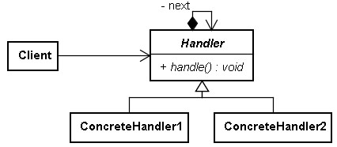
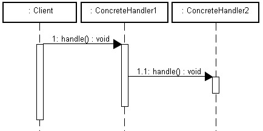

# reference
- [良葛格](http://openhome.cc/Gossip/DesignPattern/ChainofResponsibility.htm)

# class diagram



#python version
```
class Handler:
    def __init__(self, next):
        self.next = next;
    def doNext(self, c):
        if self.next:
            self.next.handle(c)

class SymbolHandler(Handler):
    def __init__(self, next):
        Handler.__init__(self, next)
        
    def handle(self, c):
        print("Symbol has been handled")
        self.doNext(c)

class CharacterHandler(Handler):
    def __init__(self, next):
        Handler.__init__(self, next)
        
    def handle(self, c):
        if c.isalpha():
            print("Character has been handled")
        self.doNext(c)        

class DigitHandler(Handler):
    def __init__(self, next):
        Handler.__init__(self, next)
        
    def handle(self, c):
        if c.isdigit():
            print("Digit has been handled")
        self.doNext(c)        

handler = SymbolHandler(CharacterHandler(DigitHandler(None)))
handler.handle('A')
handler.handle('1')
```
