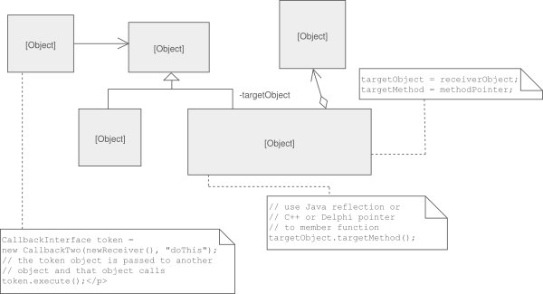

# reference
- [良葛格 command](http://openhome.cc/Gossip/DesignPattern/CommandPattern.htm)
- [source making](https://sourcemaking.com/design_patterns/command)

# class diagram


# python version

```
class Drawing:
    def processSome(self):
        print("    - 對圖片作 Some 處理")
    def processOther(self):
        print("    - 對圖片作 Other 處理")
    def processAnother(self):
        print("    - 對圖片作 Another 處理")

class ImageService:
    def __init__(self):
        self.commands = {}
        self.drawing = Drawing()
    
    def addCommand(self, effect, command):
        self.commands[effect] = command
    
    def doEffect(self, effect):
        self.commands[effect].execute(self.drawing)

class AEffectCommand:
    def execute(self, drawing):
        print("作 A 特效")
        drawing.processSome()
        drawing.processOther()

class BEffectCommand:
    def execute(self, drawing):
        print("作 B 特效")
        drawing.processOther()
        drawing.processAnother()

class CEffectCommand:
    def execute(self, drawing):
        print("作 C 特效")
        drawing.processOther()
        drawing.processSome()
        drawing.processAnother()

service = ImageService()
service.addCommand("AEffect", AEffectCommand())
service.addCommand("BEffect", BEffectCommand())
service.addCommand("CEffect", CEffectCommand())

service.doEffect("AEffect")
service.doEffect("BEffect")
service.doEffect("CEffect")
```
