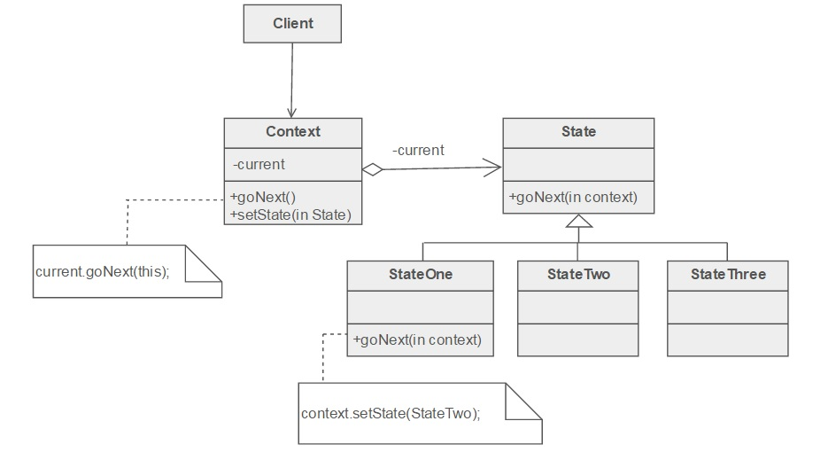

# reference
- [良葛格 state](http://openhome.cc/Gossip/DesignPattern/StatePattern.htm)
- [source making](https://sourcemaking.com/design_patterns/state)

# class diagram


# origin method in common used

```
class TrafficLight {
    private enum State {RED, GREEN, YELLOW}
    private State state = State.RED;
    void change() {
        switch(state) {
             case RED:
                 System.out.println("紅燈");
                 sleep(5000);
                 state = State.GREEN;
                 break;
             case GREEN:
                 System.out.println("綠燈");
                 sleep(5000);
                 state = State.YELLOW;                 
                 break;
             case YELLOW:
                 System.out.println("黃燈");
                 sleep(1000);
                 state = State.RED;
        }
    }
    private void sleep(int second) {
        try {
            Thread.sleep(second);
        }
        catch(InterruptedException e) {
            e.printStackTrace();
        }
    }
}
```

# python version

```
import time

class Red:
    def change(self, light):
        print("紅燈")
        time.sleep(5)
        light.set(Green())

class Green:
    def change(self, light):
        print("綠燈")
        time.sleep(5)
        light.set(Yellow())

class Yellow:
    def change(self, light):
        print("黃燈")
        time.sleep(1)
        light.set(Red())

class TrafficLight:
    def __init__(self):
        self.current = Red()
    
    def set(self, state):
        self.current = state
    
    def change(self):
        self.current.change(self)
        
trafficLight = TrafficLight()
while True:
    trafficLight.change()
```
